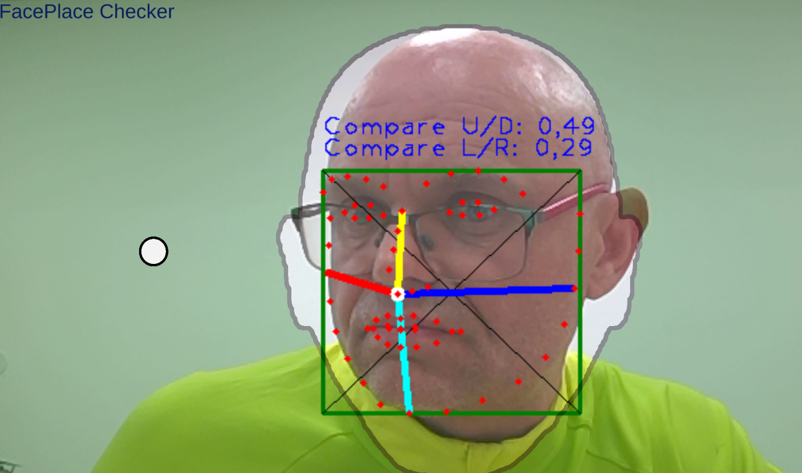
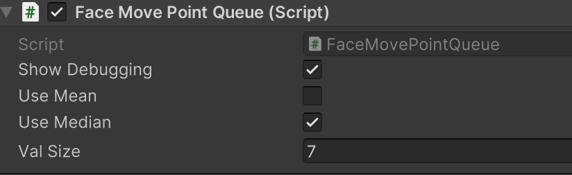
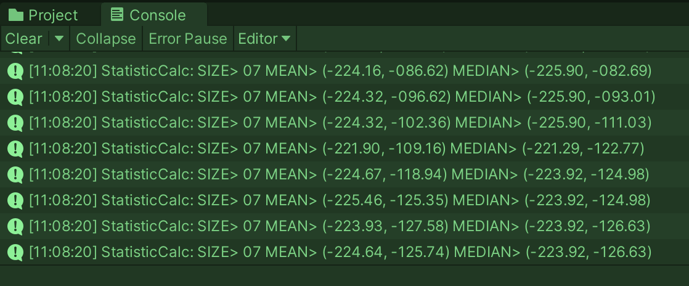

# Calc_MeanMedian
Calculations Mean and Median for better "Point" movement. 
Used for Face68 Landmark for Interface Controlling.



### Usage with FIFO[^2] and C# Queue[^1] - new Queue();

With
* enqueue
* dequeue
 
```
Vector2 myPoint = new Vector2(xPoint, yPoint);

// exchange Element
pointQueue.Enqueue(myPoint);  // first IN  FIFO
pointQueue.Dequeue();         // last  OUT FIFO

// calc Mean/Median
Vector2 meanPoint = getMeanPoint(pointQueue);
Vector2 medianPoint = getMedianPoint(pointQueue);
```



### Data Structre and Init

Uses the Vector2 (2D Point) as data structure.

```
private Queue pointQueue = new Queue();
Vector2 centerPoint = new Vector2(0.5f, 0.5f);

byte run = 0;
for (run = 0; run < valSize; run++)
    pointQueue.Enqueue(centerPoint);
```

### MEAN
```
Vector2 getMeanPoint(Queue calcPoints)
{
    Vector2 resPoint = Vector2.zero;
    foreach (var item in calcPoints)
    {
        resPoint += (Vector2)item;
    }
    return resPoint/calcPoints.Count;
}
```



### MEDIAN

```
Vector2 getMedianPoint(Queue calcPoints)
{
    Vector2 resPoint = Vector2.zero;

    float[] calcX = new float[calcPoints.Count];
    float[] calcY = new float[calcPoints.Count];

    byte run = 0;
    foreach (var item in calcPoints)
    {
        Vector2 pointItem = (Vector2)item;
        calcX[run] = pointItem.x;
        calcY[run] = pointItem.y;
        run++;
    }
    Array.Sort(calcX);
    Array.Sort(calcY);

    resPoint = new Vector2(calcX[(int)Mathf.Round((calcX.Length - 1) / 2)],
                       calcY[(int)Mathf.Round((calcY.Length - 1) / 2)]);
    return resPoint;
}
```

## Array Lists 

Usage of two arrays for X and Y

[^1]: https://www.geeksforgeeks.org/c-sharp-queue-with-examples/
[^2]: https://de.wikipedia.org/wiki/First_In_%E2%80%93_First_Out

